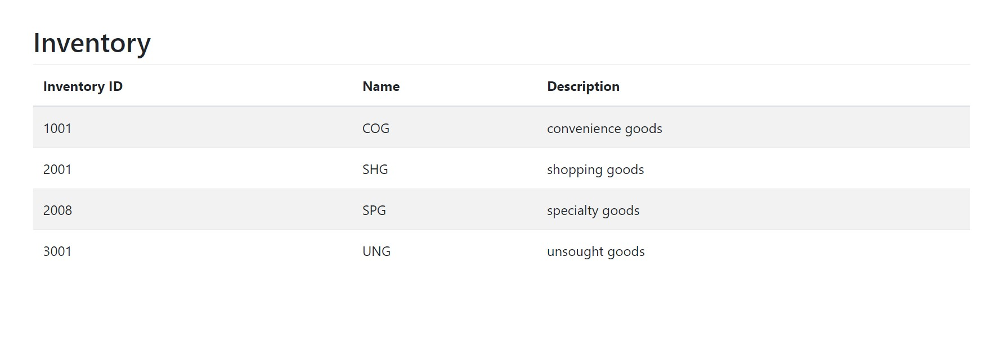

# SOLID principles
## 1. Single Responsibility Principle (SRP)
   Definition: A class should have one and only one reason to change. This means that each class should only have one responsibility or task.

### InventoryService.js: 
This class is responsible for managing the inventory data, including fetching, creating, updating, and deleting inventory items.
### InventoryController.js: 
This class is responsible for handling incoming requests from the client, routing them to the appropriate methods in the service, and sending back the responses.

## 2. Dependency Inversion Principle (DIP)
   Definition: High-level modules should not depend on low-level modules.
### High-Level Module: InventoryController
It does not create an instance of InventoryService directly. It relies on an instance of InventoryService passed to it (via constructor injection/ dependency injection ).
### Low-Level Module: InventoryService
It provides specific implementations for handling inventory but does not dictate how it is used.
### Benefits of Following SRP and DIP
# Maintainability:

Changes to one class (like adding a new method in InventoryService) do not impact the other (like InventoryController).

# Testability:

we can easily test the InventoryController without affecting InventoryService. This makes unit testing easy.

# Flexibility:

If we later decide to use a different service we can simply replace the InventoryService without modifying the InventoryController.
# Output:

